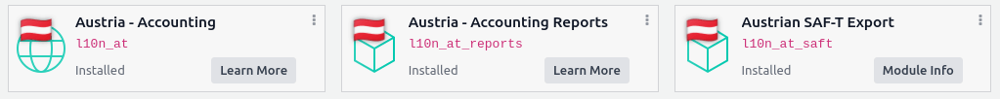
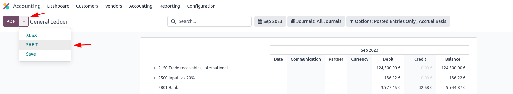

=======
Austria
=======

Configuration
=============

:ref:`Install <general/install>` the following modules to get all the features of the Austrian
localization.

.. list-table::
   :header-rows: 1

   * - Name
     - Technical name
     - Description
   * - :guilabel:`Austria - Accounting`
     - `l10n_at`
     - Default :ref:`fiscal localization package <fiscal_localizations/packages>`.
   * - :guilabel:`Austria - Accounting Reports`
     - `l10n_at_reports`
     - Adds localized versions of financial reports
   * - :guilabel:`Austrian SAF-T Export`
     - `l10n_at_saft`
     - Adds the SAF-T export.

Financial Reports
=================

Currently, the following localized reports are available:

  - Balance sheet according to `§ 224 UGB <https://www.ris.bka.gv.at/NormDokument.wxe?Abfrage=Bundesnormen&Gesetzesnummer=10001702&Artikel=&Paragraf=224&Anlage=&Uebergangsrecht=>`_;
  - Profit and loss according to `§ 231 UGB <https://www.ris.bka.gv.at/NormDokument.wxe?Abfrage=Bundesnormen&Gesetzesnummer=10001702&Artikel=&Paragraf=231&Anlage=&Uebergangsrecht=>`_ (Gesamtkostenverfahren);

.. seealso::
   :doc:`../accounting/reporting`

Standard Audit File for Tax (SAF-T)
===================================

The Austrian tax office may request a SAF-T report on an on-demand basis.
The Austrian SAF-T Export module allows exporting a SAF-T document (in XML format).

Configuration
-------------

The following explains how to ensure that all the information needed for the SAF-T export is
available. If missing information is detected during the export process,
a warning message will appear that lists the missing information.

Company
~~~~~~~

Go to :guilabel:`Settings --> General Settings`, in the :guilabel:`Companies` section, click
:guilabel:`Update Info` and fill in the following information:

- Fill in the :guilabel:`Address` and :guilabel:`Phone` fields.
  Entering (at least) :guilabel:`Street`, :guilabel:`City`, :guilabel:`ZIP`
  and :guilabel:`Country`.
- Provide your company's tax ID in the :guilabel:`Company ID` field.
- If you have one, provide your :abbr:`UID-Nummer (Umsatzsteueridentifikationsnummer)`
  in the :guilabel:`Tax ID` field number, including the country prefix.

You must have at least one **contact person** linked to your company in the :guilabel:`Contacts` app:

- If no **contact person** is linked, create a new one by clicking :guilabel:`New`,
  set it as :guilabel:`Individual`, and select your company in the :guilabel:`Company name` field.
- At least one of the :guilabel:`Phone` and :guilabel:`Mobile` fields has to be filled in
  for the contact person.

Under :guilabel:`Settings --> Accounting`, in the **Austrian localization** section,
set the following information:

- :guilabel:`ÖNACE-Code`
- :guilabel:`Profit Assessment Method`

.. _austria/SAFT/chart_of_accounts:

Chart of accounts
~~~~~~~~~~~~~~~~~

The Austrian SAF-T specification defines a chart of accounts (COA). All accounts that are relevant
for the SAF-T export have to be annotated with a fitting account from this COA.

The needed mapping information has to be supplied via tags on the accounts.
Applying the tag `1000` on an account (virtually) maps it to the account with code `1000`
in the SAF-T COA.
Similarly, any number can be used instead of `1000` to map an account to any account in the SAF-T COA
(as long as there is an account in the SAF-T COA with that code).

The :guilabel:`Austria - Accounting` module already installs a dedicated tag for each account
from the SAF-T COA. Furthermore, it installs a (suggested) mapping for many of the accounts
from the default Austrian COA (installed by :guilabel:`Austria - Accounting` module).

To find accounts that are currently unmapped (or mapped to multiple SAF-T accounts)
you can try to :ref:`export the SAF-T <austria/SAFT/generating_the_document>`.
A warning message will appear in case of problematic accounts.
It includes a button to access a list of these problematic accounts.

.. seealso::
   :doc:`../accounting/get_started/chart_of_accounts`

Customer and supplier
~~~~~~~~~~~~~~~~~~~~~

Fill in the :guilabel:`Address` of each partner that
appears in your invoices, vendor bills, or payments through the :guilabel:`Contacts` app.

For partners that are companies, you must fill in the VAT number (including the country prefix) in
the :guilabel:`Tax ID` field.

.. _austria/SAFT/generating_the_document:

Generating the SAF-T
~~~~~~~~~~~~~~~~~~~~

To export the SAF-T document follow the next steps:

  1. Go to :menuselection:`Accounting --> Reports --> General Ledger`.
  2. Open the drop-down menu on the right side of the :guilabel:`PDF` button.
  3. Click on :guilabel:`SAF-T`.

