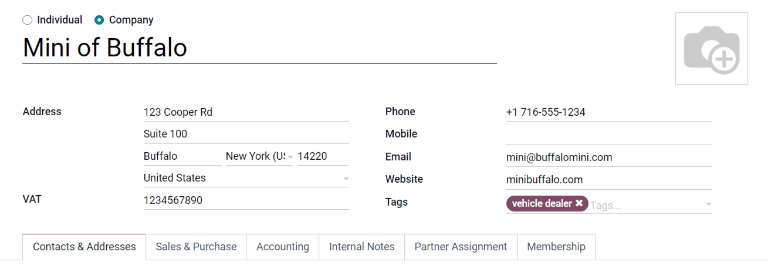

=============
Configuration
=============

The following document goes through all of the configurations and settings for the *Fleet*
application, including settings, manufacturers, models, and categories.

Settings
========

To access the settings menu, go to :menuselection:`Fleet application --> Configuration -->
Settings`. There are only two settings that need configuration, the vehicle contract alert, and
a new vehicle request.

End Date Contract Alert
-----------------------

To help ensure no contracts lapse or vehicles are left without contracted drivers, Odoo has an
alert in place to let the fleet manager and driver know when a contract is abut to expire. Enter
the number of days before a contract is going to expire that an alert email will be sent.

New Vehicle Request
-------------------

Set a limit on how many vehicle are in the fleet by setting a limit on requests. Employees will not
be able to request a new car if there is a specific amount of cars already in the fleet. Enter the
number limit for existing cars in this field.

.. image:: configuration/fleet-settings.png
   :align: center
   :alt: Settings available for the Fleet application.

Manufacturers
=============

Odoo Fleet comes pre-configured with sixty-six commonly used car manufacturers in the database,
along with their logos. To view the pre-loaded manufacturers, go to :menuselection:`Fleet app -->
Configuration --> Manufacturers`.

The list of manufacturers appear in alphabetical order. Each manufacturer's card lists how many
specific models are configured for each particular manufacturer. Odoo comes with forty five
pre-configured models for four major auto manufacturers.

.. image:: configuration/manufacturer.png
   :align: center
   :alt: Manufacturer card with the amount of models listed.

Add a manufacturer
------------------

To add a new manufacturer to the database, click :guilabel:`Create`. A manufacturer form will
load. Only two pieces of information are needed, the name of the manufacturer, and the logo. Type
the name of the manufacturer in the name field, and select an image to upload for the logo. When the
information is entered, click :guilabel:`Save`.

Vehicle Models
==============

Each manufacturer has a variety of models that they produce. When adding a vehicle to the fleet, it
is important to specify the vehicle being added. Odoo comes with pre-configured models for four
manufacturers, so it is likely new models will need to be added to the database to correctly
configure a fleet of vehicles.

Preconfigured Models
--------------------

The following models are pre-loaded in Odoo and do not need to be added to the database:

+-------+--------------+-----------+---------------+
| AUDI  | BMW          | Mercedes  |     Opel      |
+=======+==============+===========+===============+
| A1    | Serie 1      | Class A   | Agilia        |
+-------+--------------+-----------+---------------+
| A3    | Serie 3      | Class B   | Ampera        |
+-------+--------------+-----------+---------------+
| A4    | Serie 5      | Class C   | Antara        |
+-------+--------------+-----------+---------------+
| A5    | Serie 6      | Class CL  | Astra         |
+-------+--------------+-----------+---------------+
| A6    | Serie 7      | Class CLS | AstraGTC      |
+-------+--------------+-----------+---------------+
| A7    | Serie Hybrid | Class E   | Combo Tour    |
+-------+--------------+-----------+---------------+
| A8    | Serie M      | Class GL  | Corsa         |
+-------+--------------+-----------+---------------+
| Q3    | Serie X      | Class GLK | Insignia      |
+-------+--------------+-----------+---------------+
| Q5    | Serie Z4     | Class M   | Meriva        |
+-------+--------------+-----------+---------------+
| TT    |              | Class R   | Mokka         |
+-------+--------------+-----------+---------------+
|       |              | Class S   | Zafira        |
+-------+--------------+-----------+---------------+
|       |              | Class SLK | Zafira Tourer |
+-------+--------------+-----------+---------------+
|       |              | Class SLS |               |
+-------+--------------+-----------+---------------+

.. _configuration/add-model:

Add a new model
---------------

New vehicle models can easily be added to the database. To add a new model, navigate to
:menuselection:`Fleet app --> Configuration --> Vehicle Models`. Click :guilabel:`Create` and a
vehicle model form will load. Enter the following information on the form, then click
:guilabel:`Save`.

- :guilabel:`Model name`: Enter the model name in the field.
- :guilabel:`Manufacturer`: Select the manufacturer from the drop-down menu. If the manufacturer is
  not configured, type in the manufacturer and then click :guilabel:`Create` or :guilabel:`Create
  & Edit`.
- :guilabel:`Vehicle Type`: Select the vehicle type from the drop-down menu. The pre-configured
  options are :guilabel:`Car` or :guilabel:`Bike`.
- :guilabel:`Category`: Select the category the vehicle is categorized under from the drop-down
  menu. To create a new category, type in the category and then click :guilabel:`Create
  (new category)`.

.. note::
   When the manufacturer is selected, the logo for the manufacturer will automatically load in the
   image box in the top right corner.

Information tab
~~~~~~~~~~~~~~~

Model
*****

- :guilabel:`Seats Number`: Enter how many passengers the vehicle can accommodate.
- :guilabel:`Doors Number`: Enter the number of doors the vehicle has.
- :guilabel:`Color`: Enter the color of the vehicle.
- :guilabel:`Model Year`: Enter the year the vehicle was manufactured.
- :guilabel:`Trailer Hitch`: Check this box if the vehicle has a trailer hitch.

Salary
******

- :guilabel:`Can be requested`: Check this box if employees can request this model vehicle.
- :guilabel:`Catalog Value (VAT Incl.)`: Enter the MSRP (Manufacturer's Suggested Retail Price) for
  the vehicle at the time of purchase or lease.
- :guilabel:`C02 fee`: Enter the fee imposed by local taxes and regulations, per month. It is
  advised to check with the accounting department to ensure this figure is correct.
- :guilabel:`Cost (Depreciated)`: Enter the current cost for the vehicle taking into account
  depreciation. It is recommended to check with the accounting department to ensure this amount is
  correct.
- :guilabel:`Total Cost (Depreciated))`: Enter the total cost for the vehicle model, taking into
  account depreciation. It is recommended to check with the accounting department.

Engine
******

- :guilabel:`Fuel Type`: Select the type of fuel the vehicle uses form the drop-down menu. The
  options are :guilabel:`Diesel`, :guilabel:`Gasoline`, :guilabel:`Hybrid Diesel`, :guilabel:`Hybrid
  Gasoline`, :guilabel:`Plug-in Hybrid Diesel`, :guilabel:`Plug-in Hybrid Gasoline`,
  :guilabel:`CNG`, :guilabel:`LPG`, :guilabel:`Hydrogen`, or :guilabel:`Electric`.
- :guilabel:`CO2 Emissions`: Enter the carbon dioxide emissions the vehicle produces in grams per
  kilometer (g/km).
- :guilabel:`Co2 Standard`: Enter the standard amount of carbon dioxide for a similar sized vehicle.
- :guilabel:`Transmission`: Select the transmission type from the drop-down menu, either
  :guilabel:`Manual` or :guilabel:`Automatic`.
- :guilabel:`Power`: If the vehicle is electric or hybrid, enter the power the vehicle uses in
  kilowatts (kW).
- :guilabel:`Horsepower`: Enter the vehicle's horsepower in this field.
- :guilabel:`Horsepower Taxation`: Enter the amount that is taxed based on the size of the vehicles
  engine. This is determined by local taxes and regulations, and varies depending on the location.
  It is recommended to check with the accounting department to ensure this value is correct.
- :guilabel:`Tax Deduction`: This field auto-populates according to the engine specifications, and
  cannot be modified. The percentage is based on the localization settings and local tax laws.

Vendors tab
~~~~~~~~~~~

Vendors the vehicle can be purchased from may be added in this tab. To add a vendor, click
:guilabel:`Add`, and a pop-up loads with a list of all the vendors currently in the database. Select
the vendor to add by clicking the checkbox next to the vendor name, then click :guilabel:`Select`.
There is no limit to the number of vendors that can be added to this list.

If a vendor is not in the database, add a vendor by clicking :guilabel:`Create`. A vendor form will
load. Enter the information in the vendor tab, then click :guilabel:`Save & Close` to add the vendor
and close the window, or :guilabel:`Save & New` to add the current vendor and create another new
vendor.

Model Category
==============

To best organize a fleet, it is recommended to have vehicle models housed under a specific category,
to more easily see what kinds of vehicles are in the fleet. Model categories are set on the
:ref:`vehicle model form <configuration/add-model>`.

To view all the models currently set up, navigate to :menuselection:`Fleet application -->
Configuration --> Model Category`. All models are displayed in a list view.

Add a new model category
------------------------

To add a new category, click :guilabel:`Create`. A new entry line appears at the bottom of the list.
Type in the new category, then click :guilabel:`Save` to save the entry.

To reorganize how the categories appear in the list, click on the up and down arrows to the left of
the category to be moved, and drag the line to the desired position.

.. image:: configuration/models.png
   :align: center
   :alt: List view of the models in the fleet.
