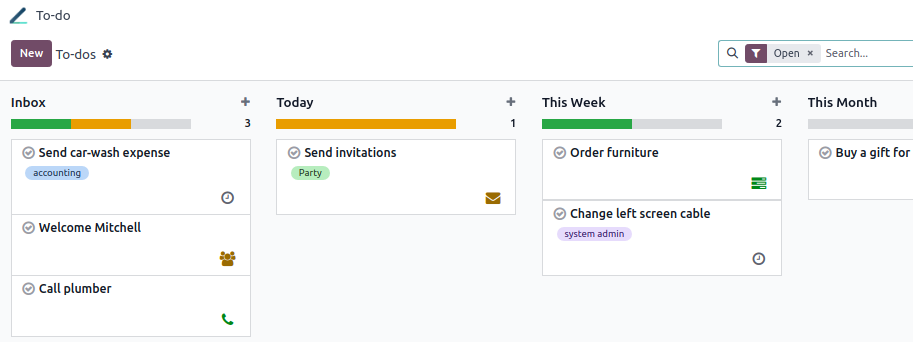
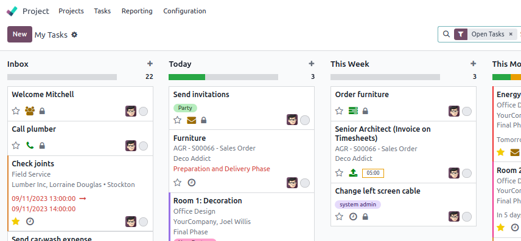

=====
To-do
=====

To-do assists users in efficiently organizing and managing their tasks. It enables collaboration and
faster workflows across different aspects of the business. It offers features such as creating and
assigning tasks, setting deadlines, creating memos and to-do lists, monitoring progress, and much
more.

Creating to-dos
===============

To create a to-do, click :guilabel:`New` or the **+** button next to a stage name. Add a title to
your to-do, then click :guilabel:`Add` to save it, or :guilabel:`Edit` to access more options.

.. tip::
   You can create a new to-do on the fly from any app in Odoo by clicking the clock icon, and
   :guilabel:`Add a To-Do`:

   .. image:: to_do/add-a-to-do-on-the-fly.png
      :alt: Add a to-do on the fly

Once created, your to-dos appear in your To-do dashboard and as private tasks under the
:guilabel:`My Tasks` in Project.

The :guilabel:`My tasks` view provides a clear overview of your assigned tasks in addition to your
private to-dos in your personal pipeline:

.. note::
   A padlock icon is visible on your private tasks to easily identify them among your project tasks.

Editing to-dos
--------------

Different actions are possible in a to-do:

- :guilabel:`Tags`: select tags from the dropdown list to categorize your to-do. You can create a
  new tag simply by writing it;
- :guilabel:`Assignees`: select one or more users from the dropdown list to assign your to-do;
- **Customize your tasks content**: when typing `/` in the text area, a dropdown list of features
  related to the structure, format, media, navigation, widgets, banner, or basic blocks appears;
- :ref:`Personal stages <to-do/personal-stages>`: move your task to another stage by clicking on
  your desired stage;
- :guilabel:`Mark as done`: click the check mark button when the task has been completed.

Click on the gear button (:guilabel:`⚙`) to access these actions :guilabel:`Archive`,
:guilabel:`Duplicate`, :guilabel:`Delete`, :guilabel:`Dashboard`, or :ref:`Convert to task
<to-do/convert-task>`.

.. note::
   To-dos, like private tasks, are only accessible to the users specified as assignees. You can use
   the :guilabel:`Assignees` field to share a to-do with other users.

.. image:: to_do/task-edition.png
   :alt: edit your task

.. _to-do/personal-stages:

Using stages
------------

Your assigned **to-do tasks** are displayed on your dashboard in different default stages. You can
drag and drop a to-do to move it from one stage to another.

Click the :guilabel:`+ Personal Stages` button to create a new stage.

.. note::
   Click the gear button (:guilabel:`⚙`) on a specific stage to :guilabel:`Fold`, :guilabel:`Edit`,
   or :guilabel:`Delete` the stage.

    .. image:: to_do/fold-edit-delete.png
       :alt: Settings button

Scheduling activities
=====================

To schedule an activity from a to-do, click on :guilabel:`Activities`; or from the dashboard, click
the clock icon on a to-do card, then :guilabel:`+ Schedule an activity`:

.. image:: to_do/schedule-activity.png
   :alt: schedule an activity

Then, fill in the required fields:

- :guilabel:`Activity Type`: select the type of activity from the list;
- :guilabel:`Summary`: add a brief description of the activity;
- :guilabel:`Due date`: select the date the activity is due;
- :guilabel:`Assigned to`: select an assignee for the activity;
- :guilabel:`Log a note`: you can add further description to the activity.

Click :guilabel:`Schedule` to complete the action.

.. note::
   The :guilabel:`To Do` :guilabel:`Activity Type` is different than a to-do task. Therefore, adding
   one doesn't create a to-do.

.. _to-do/convert-task:

Converting to-dos into project tasks
====================================

You can convert a to-do into a task and assign it to a project by going to the to-do you want to
convert, clicking the gear button (:guilabel:`⚙`) and :guilabel:`Convert to Task`. Select the
:guilabel:`Project`, add or remove :guilabel:`Assignees`, select :guilabel:`Tags` from the project,
and click :guilabel:`Convert to Task`. The to-do is now a project task and appears in the Project
app.

.. add a link to project documentation explaining visibility (once done)

Additional features
===================

Click the gear button (:guilabel:`⚙`) to display additional features:

.. image:: to_do/additional-features.png
   :alt: additional features

:guilabel:`Import records`: to upload an Excel or CSV file to import into your to-do. Click
:guilabel:`Upload File`, select the file you want to import, then click :guilabel:`Select`.

:guilabel:`Knowledge`: to insert a view of your to-dos in an article, click
:guilabel:`Insert View in article`, select the article, and click :guilabel:`New`. To insert a link
to your to-dos in an article, click :guilabel:`Insert Link in article`, select the article, and
click :guilabel:`New`.

:guilabel:`Dashboard`: to add your to-dos to :guilabel:`My Dashboard`, in the Dashboard app, click
:guilabel:`Add`.

:guilabel:`Spreadsheet`: to insert a link to your to-dos in a spreadsheet, select your spreadsheet
and click :guilabel:`confirm`.

.. tip::
   - Use the search bar to filter, group by, or save your search.
   - Use the different views to display your to-dos:

     - :guilabel:`Kanban`: it displays records as “cards” among different stages;
     - :guilabel:`List`: records are listed and grouped by stage;
     - :guilabel:`Activity`: used to display the activities linked to the to-dos. Data is displayed
       in a chart with the records forming the rows and the activity types the columns.
