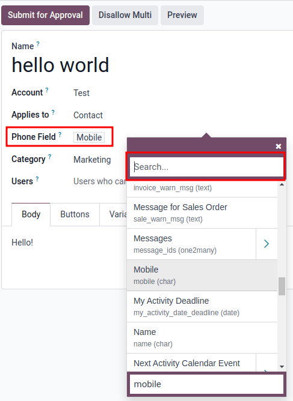
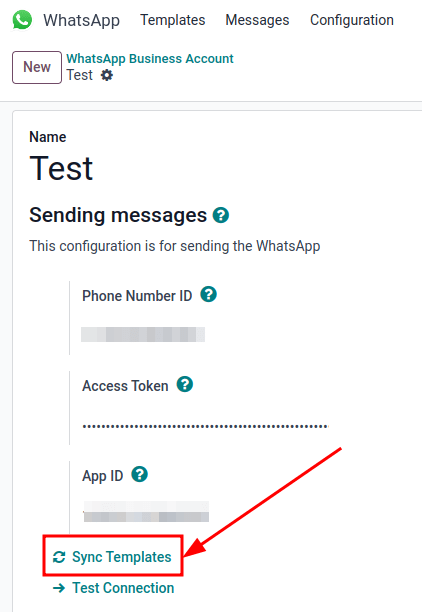

========
WhatsApp
========

**WhatsApp** is a messaging mobile app that allows users to send messages, make calls, and share
content. Businesses can use `WhatsApp Business
<https://developers.facebook.com/products/whatsapp/>`_ to communicate with their customers by text,
send documents and provide support.

With the **Odoo WhatsApp** app, a company can connect a WhatsApp Business Account (WABA) to an Odoo
database, which allows for the following:

- Receive and reply to WhatsApp messages directly from a Odoo database
- Create new templates with dynamic placeholders/variables
- Send pre-approved templates that use dynamic variables, such as:

  - Quotations from the Sales app
  - Receipts and invoices from the Point of Sale app
  - Tickets from the Events app

.. seealso::
   - `Meta Business: create message templates for the WhatsApp Business account <https://www.facebook.com/business/help/2055875911147364>`_
   - `Meta Business: connect a phone number to the WhatsApp Business account <https://www.facebook.com/business/help/456220311516626>`_
   - `Meta Business: change the WhatsApp Business display name <https://www.facebook.com/business/help/378834799515077>`_

WhatsApp is a messaging service operated by Meta, which is the parent company of Facebook. Whatsapp
is commonly used as a communication tool in many countries and by many businesses. This
documentation will cover the integration of a WhatsApp Business Account with Odoo. The company's
Meta account is configured in Odoo via a :abbr:`API (Application Programming Interface)` connection.

The Whatsapp connector supports two flows: company initiated, and customer initiated. A company can
initiate a discussion by sending a template to one or a batch of people. Once the template is sent,
the recipient can answer to trigger a discussion between the sender and the receiver (a discuss chat
window will popup if the customer answers within 15 days).

If the discussion is initiated by the client (e.g. by sending to the company's public whatsapp
number), then Odoo will open a group chat with all operators responsible for this whatsapp channel.

.. tip::
   It is recommended to set up multiple WhatsApp accounts for different departments. For example,
   the helpdesk team and sales team can chat on different channels.

WhatsApp configuration using a Meta business account
====================================================

Configuration uses a standard :abbr:`API (Application Programming Interface)` connection with Odoo.
This process will go over the creation of the app on Meta's developer console, then configuring Odoo
with it. Messages are sent and received through the *Discuss* application using a WhatsApp
:abbr:`API (Application Programming Interface)`.

First an app is created on Meta's developer console. Then the Odoo database is connected to the app.

Setup of Meta business account
------------------------------

To create a Business account with Meta (owner of Facebook) navigate to:
`<https://business.facebook.com/overview>`_. Click :guilabel:`Create account` and then enter the
business name, the administrator's name, and a work email address. Click :guilabel:`Next`, then a
pop-up will appear asking to confirm the email address. Click :guilabel:`Done` to close the window.
Follow the instructions in the email sent by Facebook to confirm the creation of the business
account and to complete the setup process. Congratulations, the Meta business account has been
created!

.. seealso::
   `Set up a Meta business account
   <https://www.facebook.com/business/help/1710077379203657?id=180505742745347>`_

.. note::
   If the business account is linked to a personal Facebook account then the administrator must
   toggle between the personal account to the business account for the remainder of the
   configuration. To toggle to the business account navigate to `<https://developers.facebook.com>`_
   and click on the *account name* in the upper right corner. Under :guilabel:`Business Accounts`
   click on the desired business that the WhatsApp configuration should take place in. This will be
   the account which Odoo will send and receive WhatsApp messages on.

   .. image:: whatsapp/toggle.png
      :align: center
      :alt: Toggle between Meta personal and business accounts.

.. important::
  In order to create a Meta business account, the user must already have a personal Facebook account
  that has existed for a minimum of one hour prior to setting up the Facebook Business account.
  Trying to create the business account prior to this time will result in an error.

App creation
------------

To create the app, navigate to `<https://developers.facebook.com>`_ and sign in with the Meta
developer account. If no account is configured yet, link a Facebook account to create a Meta
developer account.

.. seealso::
   `Set up the WhatsApp Business Platform
   <https://www.facebookblueprint.com/student/collection/409587/path/360218>`_

Click on :guilabel:`My Apps` in the top right corner after successfully signing in to the Meta
developer account. This will redirect the administrator to all the apps the developer has configured
in this specific developer account. Click on :guilabel:`Create App` to begin the process of
configuring a new Meta application.

App type
--------

On the :menuselection:`Create an app` page select :guilabel:`Other` under the section labeled,
:guilabel:`Looking for something else?`, then click :guilabel:`Next`. The page will redirect to
another page in order to select the app type. Click on the first option listed under
:guilabel:`Select an app type`, labeled :guilabel:`Business`. This selection allows for the creation
and management of the WhatsApp :abbr:`API (Application Programming Interface)`.

Click :guilabel:`Next` to configure the app. Now that the app *type* has been configured, the
administrator will move onto the app *details* section.

App details
-----------

On the :guilabel:`Details` section of the :guilabel:`Create an app` process, enter `Odoo`
under :guilabel:`Add an app name`. This name can later be changed in Settings.

.. important::
   Trademarks and branded elements may not be used in this text section. These include the Meta
   group of companies. Do not include the word: `WhatsApp` or the system will flag this in error.

Next, enter the developer email address under the :guilabel:`App contact email`.

Lastly, set the :guilabel:`Business Account - Optional` to the Meta business account using the
drop-down menu. To finish, click :guilabel:`Create app`. This action will create the app and states
that the company agrees to the Meta Platform Terms and Developer Policies.

Finally enter the Facebook password for security purposes. Click :guilabel:`Submit` to finalize the
app creation. The browser will redirect to the :guilabel:`Meta for Developers` dashboard.

.. note::
   If the Meta business account is prohibited from advertizing, claiming an app won't be allowed. To
   resolve this issue navigate to `<https://business.facebook.com/business>`_ .

   .. seealso::
      `Meta's documentation on advertizing restrictions
      <https://www.facebook.com/business/help/975570072950669>`_.

Add WhatsApp product to the app
-------------------------------

Now that the basic structure of the app has been created, a product will need to be added to the
app. To access the Meta App Dashboard go to `<https://developers.facebook.com/apps>`_ and click on
the app that is being configured.

Since WhatsApp will be used, click :guilabel:`Set up` next to the WhatsApp app box towards the
bottom of the page.

.. seealso::
   `Meta's WhatsApp developer documentation <https://developers.facebook.com/docs/whatsapp/>`_.

The page redirects to the configuration page for the :guilabel:`WhatsApp Business Platform API`.
Use the drop-down menu to select the Meta business to be configured for the :guilabel:`Select a Meta
Business Account`, then click :guilabel:`Continue` to confirm this Meta Business Account selection.

Meta will provide a WhatsApp test phone number with 5 test messages.

.. note::
   When :guilabel:`Continue` is clicked, the administrator agrees to Meta's terms and conditions as
   linked on the Meta App Dashboard.

Start using the API
-------------------

Next the administrator will configure the WhatsApp API by adding a phone number and sending a first
test message. If the browser isn't on the :guilabel:`Quickstart` page for WhatsApp navigate to
`<https://developers.facebook.com/apps>`_ and click on the app that is being configured. In the left
menu under :guilabel:`WhatsApp` (the app name is `Odoo` if the instructions above were followed). On
the left hand side, click the `V` icon next to :guilabel:`WhatsApp` to expand the menu.

A small menu will reveal itself with the following options: :guilabel:`Quickstart`, :guilabel:`API
Setup`, and :guilabel:`Configuration`. Click :guilabel:`Quickstart` and then click :guilabel:`Start
using the API`.

.. image:: whatsapp/quickstart.png
   :align: center
   :alt: Navigating to the Whatsapp quickstart wizard in Meta for Developer dashboard.

API Setup
---------

After clicking on :guilabel:`Start using the API`, the page redirects to the :guilabel:`API Setup`.
Now that the test number has been created a test message can be sent to confirm that WhatsApp is
working properly. To begin, navigate to the section on the page labeled :guilabel:`Send and receive
messages` and click the dropdown next to :guilabel:`To`, under :guilabel:`Step 1 Select phone
numbers`.

Now, select the only option available: :guilabel:`Manage phone number list`. Adding a phone number
to send to will allow for a successful test to be sent by the terminal. This is critical to ensure
the WhatsApp :abbr:`API (Application Programming Interface)` is working. Follow the steps and add up
to five numbers to send the free test messages to. After entering the appropriate country code and
phone number, click on :guilabel:`Next`.

A verification code is then sent to the phone number, which needs to be input on the next screen to
verify ownership of the number. Enter the verification code and click :guilabel:`Next` to verify the
number. This verification code will originate from WhatsApp Business.

Send a test message via terminal
~~~~~~~~~~~~~~~~~~~~~~~~~~~~~~~~

Next a test message will be sent via the terminal. Under the section labeled :guilabel:`Step 2 Send
messages with the API`, press :guilabel:`Send Message`. A test message will be sent to the phone
number that was set in the previous section. Upon successfully receiving the message to the number,
move onto the next section to produce and configure webhooks.

.. _webhooks:

Setup in Odoo
=============

The next steps to be configured are all within the Odoo database. A few different values for a
token, phone number, and account IDs need to be configured in Odoo. These are needed in order to
create a :guilabel:`Callback URL` and :guilabel:`Webhook Verify Token` which are used to configure
the Webhooks (in order to receive messages back into the database).

Navigate to :menuselection:`WhatsApp app --> Configuration --> WhatsApp Business Accounts`. Click
:guilabel:`New` to configure the WhatsApp business account in Odoo.

Then in another tab navigate to :menuselection:`https://developers.facebook.com --> My Apps -->
WhatsApp --> API Configuration`. Copy the following values from the Meta developer console *into*
the corresponding fields in Odoo:

.. list-table::
   :header-rows: 1
   :stub-columns: 1

   * - Name
     - Meta Console
     - Odoo Interface
   * - Phone
     - :guilabel:`Phone number ID`
     - :guilabel:`Phone Number ID`
   * - Token
     - :guilabel:`Temporary access token`
     - :guilabel:`Access Token`
   * - App ID
     - :guilabel:`App ID`
     - :guilabel:`App ID`
   * - Account ID
     - :guilabel:`WhatsApp Business Account ID`
     - :guilabel:`Account ID`

To retreive the :guilabel:`App Secret`, navigate to the Meta developer console,
`<https://developers.facebook.com/apps>`_ and select the app that Odoo is being configured in. Then
in the left menu, under :guilabel:`App settings`, select :guilabel:`Basic`.

Next, click :guilabel:`Show` next to the field :guilabel:`App secret`, then enter the account
password to verify ownership. Copy the :guilabel:`App secret`, then paste the copied
value into the :guilabel:`App Secret` field on the Odoo :guilabel:`WhatsApp Business Account`
configuration.

To complete the setup of the WhatsApp business account on Odoo, click :guilabel:`Test Connection`. A
successful message in green will populate in the upper right hand corner if the configuration is set
correctly.

Configuring webhooks
====================

To configure the webhooks for WhatsApp on Odoo navigate to `<https://developers.facebook.com/apps>`_
and select the app that Odoo is being configured in. Next, under the :guilabel:`WhatsApp` menu in
the left hand side, click on :guilabel:`API Setup`. Finally go to the section marked:
:guilabel:`Step 3: Configure webhooks to receive messages` and click on :guilabel:`Configure
webhooks`.

Next, the website redirects to the :menuselection:`Webhook configuration` page, click on
:guilabel:`Edit`. For the :guilabel:`Callback URL` paste the value from the Odoo database
:guilabel:`WhatsApp Business Accounts` configuration page. These values were automatically populated
after clicking on :guilabel:`Test Connection`.

Go to :menuselection:`WhatsApp app --> Configuration --> WhatsApp Business Accounts` and select the
account that is being configured. The :guilabel:`Callback URL` and :guilabel:`Webhook Verify Token`
are located under the section labeled :guilabel:`Receiving Messages`.

Paste the :guilabel:`Callback URL` from Odoo into the :guilabel:`Callback URL` field in Meta. Then
copy and paste the :guilabel:`Webhook Verify Token` into the :guilabel:`Verify Token` field on the
Meta developer console.

Finally, click :guilabel:`Verify and save`.

Webhook fields
--------------

Now input the :guilabel:`Webhook fields` into Meta's developer console, under the
:guilabel:`Webhook fields` section. Click :guilabel:`Manage` and a popup window appears. Click the
boxes in the :guilabel:`Subscribe` column for the following *field names*:

- account_update
- message_template_quality_update
- message_template_status_update
- messages
- template_category_update

Finally, click :guilabel:`Done`.

.. seealso::
   `Meta's WhatsApp documentation on setting webhooks
   <https://developers.facebook.com/docs/whatsapp/cloud-api/guides/set-up-webhooks>`_.

Add phone number
================

To configure the webhooks for WhatsApp in Odoo, navigate to
`<https://developers.facebook.com/apps>`_ and select the app that Odoo is being configured in. Next,
under :guilabel:`WhatsApp` in the left hand menu, click on :guilabel:`API Setup`. Finally go to the
section marked: :guilabel:`Step 5: Add a phone number`, and click on :guilabel:`Add phone number`.

Enter a :guilabel:`Business name`, and enter a :guilabel:`Business website or profile page`.

.. tip::
   The website or page can be a social media page or business website.

To complete filling out the business information select the country that the company does business
in from the dropdown in the :guilabel:`Country` section. An address is optional. Click
:guilabel:`Next` to continue.

The following page contains information for the :guilabel:`WhatsApp Business profile`. Complete the
following sections:

- :guilabel:`WhatsApp Business Profile Display Name`
- :guilabel:`Timezone`
- :guilabel:`Category`
- :guilabel:`Business description` (optional)

Once the sections are complete, click :guilabel:`Next`. The page refreshes and prompts the
administrator to :guilabel:`Add a phone number for WhatsApp`. Enter the phone number to configure in
WhatsApp.

.. seealso::
   `Migrate an Existing WhatsApp Number to a Business Account
   <https://developers.facebook.com/docs/whatsapp/cloud-api/get-started/migrate-existing-whatsapp-number-to-a-business-account>`_.

Next, the verification method is selected. Select either :guilabel:`Text message` or
:guilabel:`Phone call` as a method to verify the phone number. Click :guilabel:`Next` to verify and
add the phone number onto the account.

Finally enter the text message that was received by WhatsApp into the :guilabel:`Verification code`
field and click :guilabel:`Next`.

.. warning::
   If a payment method hasn't been added this will be necessary to proceed. `Visit Meta's
   documentation on how to add a payment method in Meta's Business Manager
   <https://www.facebook.com/business/help/915454841921082?id=180505742745347>`_.

.. seealso::
   `See Meta's documentation on adding a phone number
   <https://developers.facebook.com/docs/whatsapp/cloud-api/get-started/add-a-phone-number>`_.

.. _whatsapp/token:

Permanent token
===============

After testing is complete, a permanent token should be created to replace the :guilabel:`Temporary
token`. To learn more about the creation of a permanent system user access token `visit Meta's
documentation on System User Access Tokens
<https://developers.facebook.com/docs/whatsapp/business-management-api/get-started#system-user-access-tokens>`_.

Navigate to `<https://business.facebook.com/>`_ and then go to :menuselection:`Business settings -->
User --> System Users`. Select an existing system user or create a new system user by clicking on
:guilabel:`Add`.

Assets must be added to the system user and then a permanent token can be generated. Click on
:guilabel:`Add assets`. When the pop-up window appears select :guilabel:`Apps` under the
:guilabel:`Select asset type`. Then select the Odoo app. Toggle the permissions to *On* under
:guilabel:`Full control`. Click :guilabel:`Save Changes`. A confirmation window will appear
acknowledging the addition of the asset to the system user. Click :guilabel:`Done`.

Next the permanent token will be generated. Click on :guilabel:`Generate new token`, and a pop-up
window will appear asking which app this token should be generated for. Select the :guilabel:`App`
that this token is for. Then determine the expiration date of either :guilabel:`60 days` or
:guilabel:`Never`.

Finally when Meta asks which permissions should the system user allow, add all of the following
permissions:

- whatsapp_business_messaging
- whatsapp_business_management

Click :guilabel:`Generate token`. Copy the token that populates on the following screen.

Update the :guilabel:`Access Token` in the WhatsApp business account in Odoo. :ref:`webhooks`.

Go live with the Meta app
=========================

Finally, to complete the setup, the Meta app must be set to :guilabel:`Live` in the Meta developer
console to launch the app. Navigate to `<https://developers.facebook.com/apps>`_ and click on the
app that is being configured. In the top menu, toggle the :guilabel:`App Mode` field from
:guilabel:`Development` to :guilabel:`Live`.

.. note::
   If the app status is not set to *live*, then the database will only be able to contact the test
   numbers specified in the developer console.

.. warning::
   A privacy policy URL must be set in order for the app to be set to live. Go to the Meta developer
   console, `<https://developers.facebook.com/apps>`_ and select the app that Odoo is being
   configured in. Then in the left hand menu, under :guilabel:`App settings`, select
   :guilabel:`Basic`. Enter the privacy policy under :guilabel:`Privacy Policy URL`. Click
   :guilabel:`Save changes` to apply the privacy policy to the app.

A email is sent to the administrator once the app has gone live in the Meta developer console.

.. _whatsapp/watemplates:

WhatsApp templates
==================

WhatsApp templates are saved messages that are used repeatedly to send messages from the database.
They allow users to send quality communications, without having to compose the same text repeatedly.

Creating different templates that are tailored to specific situations lets users choose the right
message for the right audience. This increases the quality of the message and the overall
engagement rate with the customer.

WhatsApp templates can be created on both the Odoo and Meta consoles. The following process will
overview the process for creating templates in Odoo and then afterward in Meta.

.. important::
   WhatsApp has an approval process that must be completed before the template can be used.
   :ref:`whatsapp/approval`

.. _whatsapp/templates:

Creating templates in Odoo
--------------------------

To access WhatsApp templates go to the :menuselection:`Whatsapp app --> Templates --> New`.

At the bottom of the template  form, there are three tabs: :guilabel:`Body`, :guilabel:`Buttons`,
and :guilabel:`Variables`. These three tabs combined create the template. The text is entered into
the :guilabel:`Body` tab, and dynamic content that is called out in the :guilabel:`Body` tab is
specified in the :guilabel:`Variables` tab. Every piece of dynamic content (placeholders) in the
message (body) is specifically called out and specified in the :guilabel:`Variables` tab.

Templates are prefabricated layouts that allow users to send professional looking messages to
customers. These templates are capable of containing dynamic data that will populate in the end
message using variables that are set in the template configuration. For example, messages can
contain the end user's name, call out specific products, or reference a sales order, to name a few
convenient and impactful variables.

To create a WhatsApp template, click on :guilabel:`New`. Enter a :guilabel:`Name` for the template,
then select the :guilabel:`Language`.

Under the :guilabel:`Account` select the *WhatsApp business account* in Odoo that this template
should link to. Next, under the :guilabel:`Applies to` field select the *model* the server action
for this template, will *apply to*. In order to complete this task administrator access rights are
needed. :doc:`See this access rights documentation <../general/users/access_rights>`.

.. tip::
   These models can also be accessed in :ref:`developer mode <developer-mode>`. On a contact form
   (or other relevant form in Odoo), navigate to the model that will be referenced, and hover over
   any field name. A box of backend information will reveal itself with the specific Odoo
   :guilabel:`Model` name in the backend. Search (using front-end name) for this model in the
   :guilabel:`Applies to` drop-down menu in the WhatsApp template.

Often when changing the model or :guilabel:`Applies to` field the :guilabel:`Phone Field` may
produce an error. The :guilabel:`Phone field` should always be set to `Phone` or `Mobile`. To search
the available fields, type in the front-end name (on user-interface) of the field in the search box.
This will find a result from all of the available fields for the model (:guilabel:`Applies to`) that
the template is created for. There may be multiple levels that need to be navigated to find the
correct field.

Change the :guilabel:`Category` to fit either a :guilabel:`Marketing`, :guilabel:`Utility`, or
:guilabel:`Authentication` category. In most instances the first two options will be used, unless
the user would like to send a password reset or something security related. Set to
:guilabel:`Marketing` should there be anything promotional being sent and set to :guilabel:`Utility`
should there be general transactional messages being sent (sales order, event ticket, etc).

.. important::
   Specifying an incorrect category can cause a flag/rejected status from Meta during the approval
   process.

Add any :guilabel:`Users` that are allowed to use this template. On the right hand column of the top
configurations a :guilabel:`Header type` can be configured along with a :guilabel:`Header message`.

The available :guilabel:`Header types` are as follows:

- Text
- Image
- Video
- Document
- Location (variables need to be set)

Navigate to the :guilabel:`Body` tab to configure the main message of the template.

When all the necessary changes are made to the template, then click on the :guilabel:`Submit for
approval` button in the upper left hand corner. The status of the template will change to
:guilabel:`Pending`. The status will remain in :guilabel:`Pending` until a decision has been made by
Meta. Once the user receives an email confirming that the template has been approved the templates
will need to be synced from the Odoo database.

See this documentation: :ref:`whatsapp/sync`.

.. tip::
   There are pre-configured demo-data templates available in Odoo to use or modify. These templates
   can be used as-is or modified to suit a specific business need. To use these templates,
   navigate to :menuselection:`WhatsApp app --> Templates` and select a pre-configured template.
   Click :guilabel:`Submit for Approval` to start the approval process. An email will be sent to the
   administrator of the Meta account when the template has been approved.

Buttons
-------

Buttons can be added into the message from the :guilabel:`Buttons` tab. Enter the :guilabel:`Type`
(either :guilabel:`Visit Website`, :guilabel:`Call Number`, or :guilabel:`Quick Reply`). Then
specify the :guilabel:`Button Text`, :guilabel:`Call Number` or :guilabel:`Website URL` (including
:guilabel:`Url Type`) depending on the :guilabel:`Type` of button.

.. note::
   Buttons can also be added on the Meta business console. See Meta's WhatsApp template dashboard by
   navigating to `<https://business.facebook.com/wa/manage/home>`_. Then go to
   :menuselection:`Account tools --> Message templates`.

Using placeholders and variables
--------------------------------

Dynamic variables reference certain fields within the Odoo database to produce unique data in the
WhatsApp message when using a template. Dynamic variables are encoded to display fields from within
the database referencing fields from within a model.

.. example::
   Many companies like to customize their WhatsApp messages with a personalized piece of customer
   information to grab attention. This can be accomplished in Odoo by referencing a field within a
   model by setting a dynamic variable. For example, a customer's name can be referenced in the
   email from the :guilabel:`Customer` field on the :guilabel:`Sales Order` model.

Dynamic variables can be added in to the :guilabel:`Body` by adding :guilabel:`placeholders` in the
*text*. To add a placeholder in the *message body* enter the following text `{{1}}`. For the second
placeholder enter `{{2}}` and  increase incrementally as more placeholders are added to the text.

.. example::
   **The following is the text from payment receipt template body:**

   Dear {{1}},

   Here is your invoice *{{2}}* from *{{3}}* for a total of *{{4}}{{5}}*.
   To review your invoice or , pay online: {{6}}

   Thank you

.. seealso::
   :ref:`whatsapp/templates`

These placeholders must be configured on the :guilabel:`Variables` tab of the template before
submitting for approval from Meta. To edit the dynamic variables on a template, first change the
:guilabel:`Type` to :guilabel:`Field of Model`. This allows Odoo to reference a field within a model
to produce unique data in the message being sent.

Next, edit the :guilabel:`Field` field of the dynamic variables. The :guilabel:`Applies to` field in
the template should be edited prior to ensure the correct model and field are referenced.

To search the available fields, type in the front-end name (on user-interface) of the field in the
search box. This will find a result from all of the available fields for the model
(:guilabel:`Applies to`) that the template is created for. There may be multiple levels that need to
be configured.

.. example::
   The following is an example of the variables set for the above placeholders in the payment
   receipt noted above:

   .. list-table::
      :header-rows: 1
      :stub-columns: 1

      * - Name
        - Sample Value
        - Type
        - Field
      * - body - {{1}}
        - Azure Interior
        - Field of Model
        - `Partner`
      * - body - {{2}}
        - INV/2022/00001
        - Field of Model
        - `Number`
      * - body - {{3}}
        - My Company
        - Field of Model
        - `Company`
      * - body - {{4}}
        - $
        - Field of Model
        - `Currency > Symbol`
      * - body - {{5}}
        - 4000
        - Field of Model
        - `Amount`
      * - body - {{6}}
        - https://..
        - Portal link
        -

.. example::
   For example, in the :guilabel:`Body` tab, if the following is typed, "Hello {{1}},", then `{{1}}`
   must be set in the variables tab. For this specific case, the message should greet the customer
   by name, so the `{{1}}` should be configured to populate the `{{1}}` :guilabel:`Field` with the
   :guilabel:`Customer` name.

.. warning::
   Customizing WhatsApp templates is out of the scope of Odoo Support.

.. _whatsapp/approval:

Meta template approval
----------------------

After updating the dynamic variables on the template, the template needs to be submitted to Meta for
approval again. Click :guilabel:`Submit for Approval` to start the approval process. An email will
be sent to the administrator of the Meta account when the template has been approved.

Following the approval from Meta, sync the templates again in the Odoo database. See this
documentation: :ref:`whatsapp/sync`.

.. tip::
   To see the status to Meta's WhatsApp template dashboard by navigating to
   `<https://business.facebook.com/wa/manage/home>`_. Then go to :menuselection:`Account tools -->
   Message templates`.

.. _whatsapp/sync:

Syncing templates
-----------------

Templates must be synced on the Odoo database once they are approved by the Meta team. To do so,
navigate to :menuselection:`WhatsApp app --> Configuration --> WhatsApp Business Accounts`. Select
the configuration that should be synced. Under the section marked :menuselection:`Sending messages`,
towards the bottom, click on :guilabel:`Sync Templates`. Meta will update the templates that are
approved so that they can be utilized with various apps in the database.

         highlighted.

A successful message in green appears in the upper right hand corner with the number of
templates updated.

.. tip::
   Templates can also be synced individually from the template itself. Navigate to
   :menuselection:`WhatsApp app --> Templates` and select the template to sync. Click on
   :guilabel:`Sync Template` in the top menu.

Creating templates in Meta
==========================

Navigate to Meta's WhatsApp template dashboard by navigating to
`<https://business.facebook.com/wa/manage/home>`_. Then go to :menuselection:`Account tools -->
Message templates`.

   .. image:: whatsapp/account-tools.png
      :align: center
      :alt: Account tools highlighted in business manager with the manage templates link
            highlighted.

To create a WhatsApp template, click on :guilabel:`Create template` (blue button), then select the
:guilabel:`Category`. The options listed include: :guilabel:`Marketing`, :guilabel:`Utility`, and
:guilabel:`Authentication`. In most instances the first two options will be used, unless the user
would like to send a password reset or something security related.

Enter the :guilabel:`Name` of the template and then select the :guilabel:`Language` for the
template.

.. note::
   Multiple languages can be selected by typing the language name(s) and selecting the other
   languages as needed.

.. image:: whatsapp/template-config.png
   :align: center
   :alt: Template configuration options listed, with Marketing, Utility, Name and Language
         highlighted.

After making the appropriate selections, click on :guilabel:`Continue` in the upper right hand
corner. The page redirects to the :guilabel:`Edit template` page. Here the :guilabel:`Header`,
:guilabel:`Body`, :guilabel:`Footer` and :guilabel:`Buttons` are configured. To the right of the
template is a preview of what the template will look like in production.

.. image:: whatsapp/edit-template.png
   :align: center
   :alt: Edit the template using a header, body, footer and buttons.

When all the necessary changes are made to the template, then click on the :guilabel:`Submit` button
in the upper right hand corner. A confirmation window appears to confirm the Language, then click
:guilabel:`Confirm`. Another confirmation appears stating that the template will be submitted to
Meta for review and approval. The :guilabel:`Status` will remain in :guilabel:`In review` until a
decision has been made by Meta. Once the user receives an email confirming that the template has
been approved the templates will need to be synced from the Odoo database.

.. seealso::
   For more information on configuring templates on the Meta developer console visit `Meta's
   WhatsApp template documentation
   <https://developers.facebook.com/docs/whatsapp/business-management-api/message-templates/>`_.

Notifications
=============

Notifications in WhatsApp are handled similar to a message conversation in Odoo. A pop-up window
appears with the received conversation from the customer. By default notifications are set in the
WhatsApp business account configuration in Odoo.

Navigate to :menuselection:`WhatsApp app --> Configuration --> WhatsApp Business Accounts`. Select
the account and scroll down to the :menuselection:`Control` section where notifications are handled.
Under :guilabel:`Notify users` type in the user(s) that should be notified for this particular
WhatsApp channel.

.. note::
   Once a conversation is initiated between a user and a customer, notifications to all the users
   specified in the WhatsApp business account configuration won't occur. Only notifications to
   the user(s) in the conversation will occur. Should the user not respond within 15 days, the
   customer's reply after the 15 days will populate once again to all the users specified in the
   WhatsApp configuration.

Adding users to chat
====================

Users can be added to a WhatsApp chat by expanding the WhatsApp pop-up window. WhatsApp
conversations are located in the *Discuss* app. Click on the person icon with the plus [ + ] icon
next to it. A window appears to invite users to the conversation.

.. image:: whatsapp/add-users.png
   :align: center
   :alt: Adding users to a WhatsApp conversation, with the add user icon highlighted.

WhatsApp API FAQ
================

Verification
------------

As of February 1, 2023, if the Meta app requires advanced level access to permissions, a complete
business verification may need to be completed. This includes submitting office business documents
to Meta. `See this documentation
<https://developers.facebook.com/docs/development/release/business-verification>`_.

.. seealso::
   `Meta's WhatsApp access verification documentation
   <https://developers.facebook.com/docs/development/release/access-verification/>`_.

Template errors
---------------

Editing templates can cause tracebacks and errors unless the exact process is followed above
(:ref:`whatsapp/watemplates`).

Duplicate validation error
~~~~~~~~~~~~~~~~~~~~~~~~~~

When syncing the templates they may be an instance when there is a template with the same name on
Meta's business manager and on the Odoo side. This causes a duplicate validation error. To correct
this issue, rename the duplicate template name on Odoo and sync the templates once again. see
:ref:`whatsapp/sync`.

Token errors
------------

User error
~~~~~~~~~~

Should the temporary token not be replaced with a permanent token a user error will populate in Odoo
when testing the connection after sending fails. To correct this issues see :ref:`whatsapp/token`.

.. image:: whatsapp/user-error.png
   :align: center
   :alt: User error populated in Odoo when token expires.

System user error 100
~~~~~~~~~~~~~~~~~~~~~

Should the system user be an :guilabel:`Employee` when setting up the permanent token
(:ref:`whatsapp/token`), a user error 100 will populate.

To correct this error create an :guilabel:`Admin` system user, following the process outlined here:
:ref:`whatsapp/token`.

.. image:: whatsapp/user-error-2.png
   :align: center
   :alt: User error populated in Odoo when an employee token is generated instead of a Admin user.
